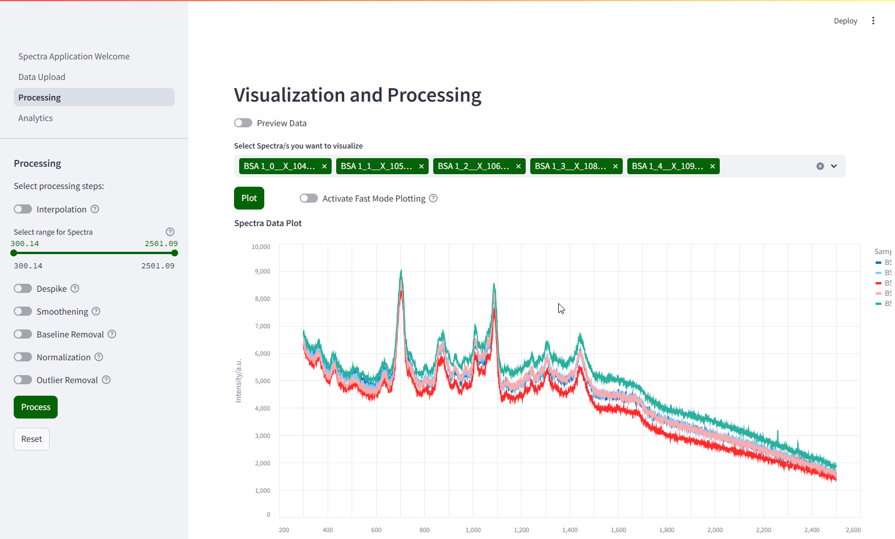

[](https://fengboma.github.io/docs.spectraguru/) 
[](https://www.apache.org/licenses/LICENSE-2.0) 
[](https://streamlit.io/)

# SpectraGuru - Spectra Analysis Application

*SpectraGuru is currently under development! Thank you for your patience.*

Find our documentation page: [here](https://fengboma.github.io/docs.spectraguru/)!

## What is SpectraGuru?
SpectraGuru is a spectra analysis application designed to provide user-friendly tools for processing and visualizing spectra, aimed at accelerating your research. It functions as a dashboard or a specialized tool within a Python environment, organized with various modular functions that allow users to process spectroscopy data in a pipeline. SpectraGuru is based on the Python streamlit framework. 




---

## Quick start

### Visit our site

Our application is hosted [here](https://spectraguru.org)! Please use it directly, as easy as it can go.

### Deploy locally

You do not have to host it locally to use the application. But if you wish to deploy it locally, please follow these steps:

1. Install Python and dependencies
   
   SpectraGuru runs on:

       altair==5.5.0

       Authlib==1.6.5

       deprecation==2.1.0

       matplotlib==3.10.6

       numpy==2.3.3

       pandas==2.3.2

       psycopg2==2.9.10

       scikit_learn==1.7.2

       scipy==1.16.2

       seaborn==0.13.2

       streamlit==1.49.1

       streamlit_extras==0.7.8

    Or use requirements.txt to install the dependencies: 

```
pip install -r requirements.txt
```

2. Clone the main repo

```
cd <FILE LOCATION>

git clone https://github.com/FengboMa/SpectraGuru_beta.git
```

3. Run Spectra Application Welcome.py
4. Run the following command

```
streamlit run SpectraGuru_beta/Spectra Application Welcome.py
```
5. Your local version should be up in port 8501 by default in your favorite browser!

---

### About this Project
The project was started in Jun 2024 by Dr. Yiping Zhao and Dr. Xianyan Chen from the University of Georgia. See more [about us](https://www.zhao-nano-lab.com/)!

---

### Help and Support

If you have any questions, comments, and observations, please let us know! Email: zhao-nano-lab@uga.edu.


