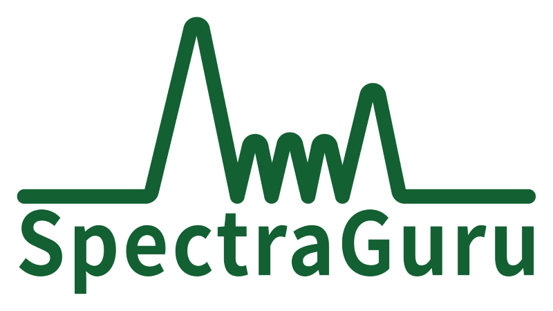
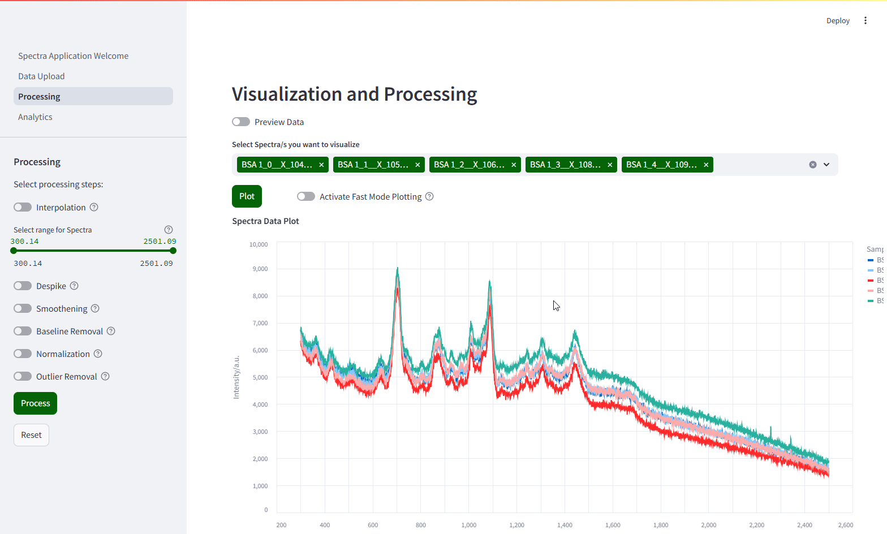

[](https://fengboma.github.io/docs.spectraguru/) 
[](https://www.apache.org/licenses/LICENSE-2.0) 
[](https://streamlit.io/)

# SpectraGuru - Spectral Analysis Application

*SpectraGuru is currently under development! Thank you for your patience.*

Find our documentation page: [here](https://fengboma.github.io/docs.spectraguru/)!

## What is SpectraGuru?
SpectraGuru is a spectral analysis application designed to provide user-friendly tools for processing and visualizing spectra, aimed at accelerating your research. It functions as a dashboard or a specialized tool within a Python environment, organized with various modular functions that allow users to process spectroscopy data in a pipeline. SpectraGuru is based on the Python Streamlit framework.



## Cite SpectraGuru

If SpectraGuru contributes to your research, please cite our papers:

1. Fengbo Ma, Jiaheng Cui, Amit Kumar, Yanjun Yang, Xianyan Chen, and Yiping Zhao. *Comprehensive Open-Source Ecosystem for Raman and SERS Spectroscopy: Introducing SpectraGuru*. *Analytical Chemistry* **2026**, *98* (15), 11186–11196. [Read online](https://doi.org/10.1021/acs.analchem.5c07799).

2. Fengbo Ma, Jiaheng Cui, Amit Kumar, Yanjun Yang, Jessica McCabe Hutcheson, Xianyan Chen, Haijian Sun, and Yiping Zhao. *SpectraGuru: a community-guided path toward scalable Raman and SERS analysis*. *Proceedings of SPIE* **13846**, *Biomedical Vibrational Spectroscopy 2026: Advances in Research and Industry*, 1384608 (5 March 2026). [Read online](https://doi.org/10.1117/12.3086068).


---

## Quick start

### Visit our site

Our application is hosted [here](https://spectraguru.org)! Please use it directly, as easy as it can go.

### Deploy locally

You do not have to host it locally to use the application. But if you wish to deploy it locally, please follow these steps:

1. Install Python and dependencies

   SpectraGuru is tested with Python 3.12. The important runtime packages are pinned in `requirements.txt`:

   - `streamlit==1.64.0`
   - `pandas==2.3.2`
   - `numpy==2.5.3`
   - `scipy==1.16.2`
   - `scikit-learn==1.7.2`
   - `matplotlib==3.10.6`
   - `seaborn==0.13.2`
   - `altair==5.5.0`
   - `streamlit-extras==0.7.8`
   - `psycopg2==2.9.10`
   - `PyWavelets==1.9.0`
   - `filelock==3.25.2`
   - `deprecation==2.1.0`

   Install them with:

```
pip install -r requirements.txt
```

2. Clone the main repo

```
cd <FILE LOCATION>

git clone https://github.com/FengboMa/SpectraGuru_beta.git
```

3. Run SpectraGuru Home.py
4. Run the following command

```
streamlit run "SpectraGuru_beta/SpectraGuru Home.py"
```
5. Your local version should be up in port 8501 by default in your favorite browser!

---

### About this Project

SpectraGuru was started in June 2024 by Dr. Yiping Zhao and Dr. Xianyan Chen at the University of Georgia. It brings together open-source Raman and SERS data processing, visualization, and analysis in a browser-based application. Community feedback guides the development of accessible, reproducible workflows for research and education. Learn more about the team at [Zhao Nano Lab](https://www.zhao-nano-lab.com/).

#### Funding and cloud infrastructure support

SpectraGuru is supported by:

- The **National Science Foundation (NSF)** through the [Pathways to Enable Open-Source Ecosystems (POSE) Program](https://www.nsf.gov/funding/initiatives/pathways-enable-open-source-ecosystems), award No. **2518273**.
- **NSF CloudBank**, through **ACCESS**, for *Sustaining Cloud Infrastructure for SpectraGuru: An Open-Source Raman/SERS Data, AI, and Community Platform*, project ID **CHE260089**.
- The **U.S. Department of Agriculture (USDA)** through Animal and Plant Health Inspection Service (**APHIS**) grant **AP230A000000C009** and National Institute of Food and Agriculture (**NIFA**) grant **2023-67015-39237**.

<p>
  <a href="https://www.nsf.gov/"></a>
  &nbsp;&nbsp;
  <a href="https://www.usda.gov/"></a>
</p>

---

### Help and Support

If you have any questions, comments, and observations, please let us know! Email: zhao-nano-lab@uga.edu.
